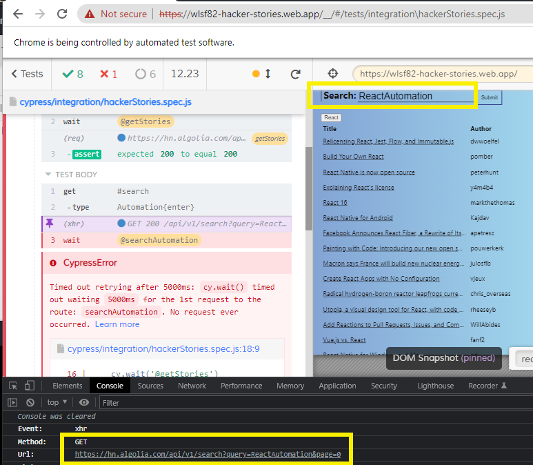
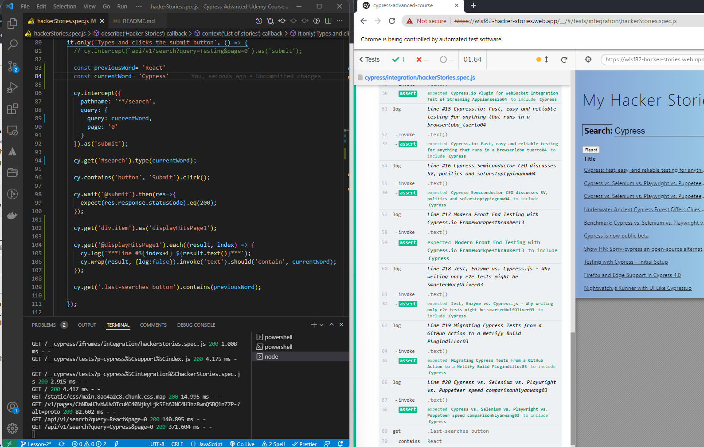
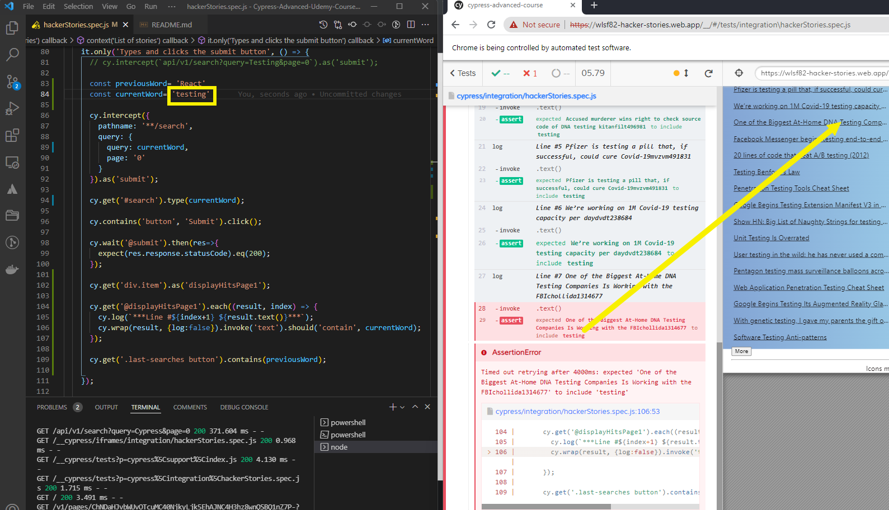
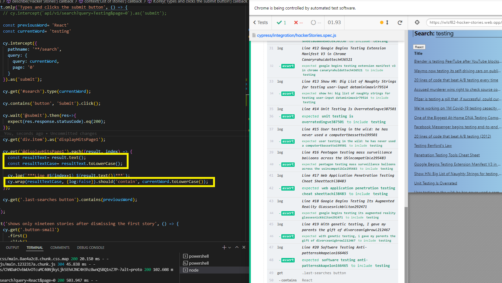

# Lesson 2
## First extra credit
### Shows 20 stories, then the next 20 after clicking More
- Test that when clicking more to move to the next page, our article count increases by 20.

- First notice when the page reloads the input field defaults to display the word React, for the purposes of this test we don't want to clear the entry out, we're only interested in making sure our assertion of displaying the next 20 entries in the second page asserting a total of 40 articles passes.

- For this we open inspector tool, click Network tab, clear out any content there.  While this is open scroll to the bottom of the actual web page and click more.

- This returns a GET request method for url `https://hn.algolia.com/api/v1/search?query=React&page=0`

- Now using this information we can intercept that call 2 different ways and set an alias for the response.

  `cy.intercept(`api/v1/search?query=React&page=1`).as('page1');`

  or

  `cy.intercept({
          pathname: '**/search',
          query: {
            query: 'React',
            page: '1'
          }
        }).as('page1');`

  Now after we click the button More we wait for that response using an alias and as a follow up make the assertion we have 40 articles.

## Second extra credit
### Types word Automation and hits ENTER

- Test that we are able to search for word by clicking enter
- We intercept `api/v1/search?query=Automation&page=0`).as('searchAutomation');` but notice it fails

- This is because our application reloads every time we execute an it block in our spec file and default behavior of the application is to start the search with React and appends our text to the end of this.

- To fix this we set a beforeEach hook where we target the search field and clear this allowing us to execute the test without error.

  `beforeEach(() => {
      //current code
      cy.get('#search').clear();
    })`
  \
## Third extra credit
### Types and clicks the submit button
- Test that we can search for a word by clicking the submit button
- Test that previous results button shows a button with the word React
- Test that the word we are searching for appears in each of the results returned

- First we declare two variables, one to store the default current word that gets loaded in the search input field when we first visit the page and a second one to store the value of the word we want to include in our article search results.

  `const previousWord= 'React'`

  `const currentWord= 'testing'`

- We'll want to grab each individual line result that is returned after we click submit and store this as an alias so we can later iterate over those results and assert the text value.

  ` cy.get('div.item').as('displayHitsPage1');`

- Notice the behavior when we search for a word that starts with an upper case for instance Cypress, the test has no problems passing.

- On the other hand if our article results have the word we are searching for in different case sensitivity the test will fail.

- To fix this we need to transform the case for the word we are searching for in addition to the text result from the article, that way now that they're both in same case we'll have no problems finding them.

  `cy.get('@displayHitsPage1').each((result, index) => {
    const resultText= result.text();
    const resultTextCase= resultText.toLowerCase();
    cy.log(`***Line #${index+1} ${result.text()}***`);
    cy.wrap(resultTextCase, {log:false}).should('contain', currentWord.toLowerCase());
  });`

