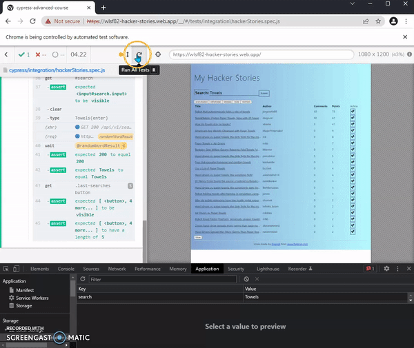

# Lesson 7
## Reading info from localStorage
- Going deeper into validating our applications localStorage is saving the correct information we can use `cy.getLocalStorage` and make an assertion on the values stored there.
- To use the available commands for localStorage we have to import the package into our `commands.js` file declaring the following: `import 'cypress-localstorage-commands'`

- Now we need to find out what is the key name that we'll have to pass to our method.  We can open dev tools in the browser, Application tab expand Local Storage and note the Key name = search

- All that's left to do is to refactor our code an insert this command after the alias for our intercepts has been found and assert the value is eq to the word we are searching for, in this case since we are storing the previous and current words as variables we can reference both of these in the command.

        cy.getLocalStorage('search')
        .should('eq', wordResult);

- When we execute the text we can open Local Storage and see the value changing, in the test runner we'll see the assertion after `expected 200 to equal 200`

